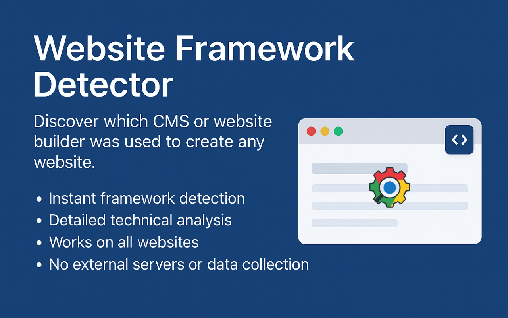
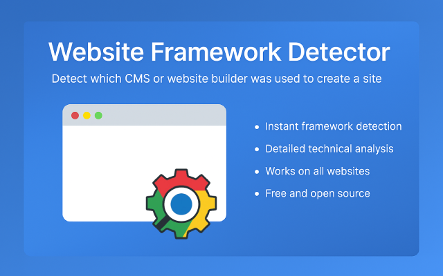

# Website Framework Detector

[](https://chromewebstore.google.com/detail/website-framework-detecto/ebkogcpaeaofidbegiadlfcfhlnaccnn?authuser=0&hl=en-GB)
[](LICENSE)
[](https://github.com/anupammo/site-platform-detector)

> **🔍 Discover which CMS or website builder was used to create any website**

A powerful Chrome extension that instantly identifies the technology stack behind any website. Analyze page structure, scripts, and meta tags to detect platforms like WordPress, Shopify, Wix, Webflow, and many others.

## 🚀 Installation

**[Install from Chrome Web Store →](https://chromewebstore.google.com/detail/website-framework-detecto/ebkogcpaeaofidbegiadlfcfhlnaccnn?authuser=0&hl=en-GB)**

## 📖 Description

Discover which CMS or website builder was used to create any website. Our extension analyzes page structure, scripts, and meta tags to identify platforms like WordPress, Shopify, Wix, Webflow and many others.

## ✨ Features

- **🚀 Instant framework detection** - Get results in seconds
- **🔍 Detailed technical analysis** - Deep insights into website architecture
- **🌐 Works on all websites** - Universal compatibility across the web
- **🔒 No external servers or data collection** - Complete privacy protection
- **💰 Free and open source** - Always free to use and contribute

## 🎯 How it works

1. **Install the extension** from the Chrome Web Store
2. **Navigate to any website** you want to analyze
3. **Click the extension icon** in your browser toolbar
4. **See the detected framework** with confidence scores and technical details

## 🛡️ Privacy Policy

This extension does **not** collect, store, or transmit any personal information. All analysis happens locally in your browser. Your privacy is our priority.

- ❌ No data collection
- ❌ No external API calls
- ❌ No user tracking
- ✅ 100% local analysis
- ✅ Complete privacy protection

## 🔧 Supported Frameworks & Technologies

### CMS & Website Builders
- WordPress
- Shopify
- Wix
- Webflow
- Squarespace
- Joomla
- Drupal
- Magento

### Frontend Frameworks
- React
- Angular
- Vue.js
- Svelte
- Alpine.js

### CSS Frameworks
- Bootstrap
- Tailwind CSS

### Analytics & Tracking
- Google Analytics
- Google Tag Manager
- Facebook Pixel
- Hotjar
- And many more...

## 📸 Screenshots




## 🛠️ Development

### Prerequisites
- Chrome browser
- Basic knowledge of JavaScript and Chrome Extensions

### Local Installation
1. Clone this repository
2. Open Chrome and navigate to `chrome://extensions/`
3. Enable "Developer mode"
4. Click "Load unpacked" and select the project directory

### Project Structure
```
site-platform-detector/
├── manifest.json          # Extension manifest
├── popup.html             # Extension popup UI
├── popup.js              # Popup logic
├── content.js            # Main detection logic
├── background.js         # Background script
├── themeDetector.js      # Theme detection module
├── techStackDetector.js  # Tech stack detection module
├── siteInfoDetector.js   # Site info detection module
├── icons/                # Extension icons
├── screenshots/          # Screenshots for store
└── marketing/            # Marketing materials
```

## 🤝 Contributing

We welcome contributions! Please feel free to submit a Pull Request. For major changes, please open an issue first to discuss what you would like to change.

## 📞 Support

For support or feature requests, please contact:

- **Email:** [a09051985@gmail.com](mailto:a09051985@gmail.com)
- **Website:** [https://anupammondal.in](https://anupammondal.in)
- **Issues:** [GitHub Issues](https://github.com/anupammo/site-platform-detector/issues)

## 📄 License

This project is licensed under the MIT License - see the [LICENSE](LICENSE) file for details.

## 🌟 Show your support

Give a ⭐️ if this project helped you!

---

**Made with ❤️ by [Anupam Mondal](https://anupammondal.in)**