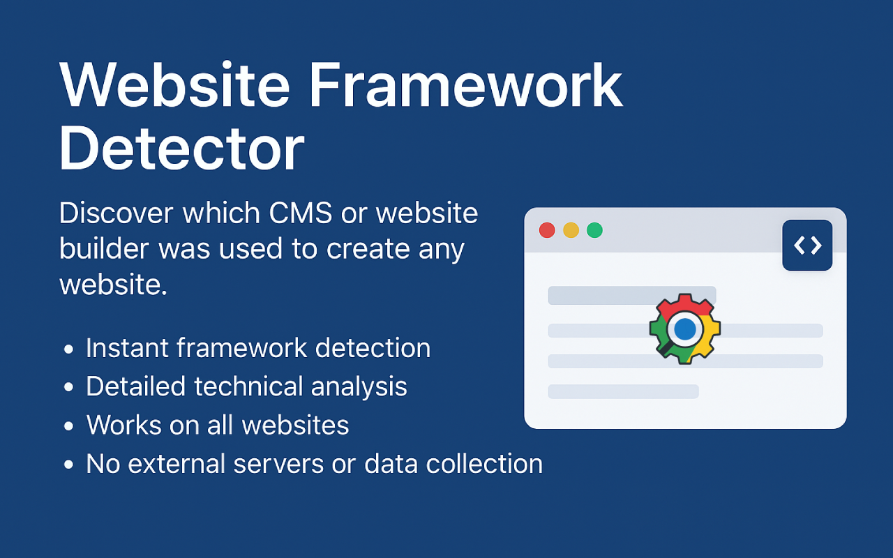
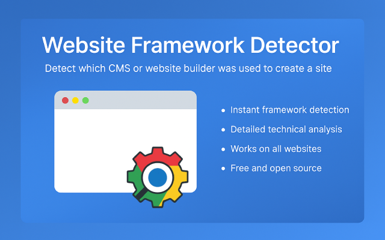

# Website Framework Detector

> Instantly reveal the CMS, website builder, and full tech stack behind any website — privately, in your browser, with zero tracking.

[](https://chromewebstore.google.com/detail/website-framework-detector/ebkogcpaeaofidbegiadlfcfhlnaccnn)
[](https://chromewebstore.google.com/detail/website-framework-detector/ebkogcpaeaofidbegiadlfcfhlnaccnn)
[](https://chromewebstore.google.com/detail/website-framework-detector/ebkogcpaeaofidbegiadlfcfhlnaccnn/reviews)
[](https://developer.chrome.com/docs/extensions/mv3/intro/)
[](LICENSE)
[](marketing/privacy.html)

🔗 **[Install from the Chrome Web Store](https://chromewebstore.google.com/detail/website-framework-detector/ebkogcpaeaofidbegiadlfcfhlnaccnn)** · **[Learn more](https://anupammondal.in/chrome-extension/website-framework-detector)**

Website Framework Detector is a lightweight Chrome extension that identifies which platform powers a site — **WordPress, Shopify, Wix, Webflow, Squarespace, Joomla, Drupal** and more — along with its frontend libraries, backend hints, theme, and the marketing/analytics tools it loads. Everything runs **locally**: no account, no servers, no data collection.



---

## Why this extension

Most "what is this site built with" tools either phone home, require an account, or quietly profile your browsing. This one doesn't. It is built around three principles:

- **Private by default** — detection happens entirely in your browser. Nothing is sent anywhere.
- **Lean by design** — only the `activeTab` permission, and code runs **only when you click**, never silently on every page.
- **Honest results** — confidence scores reflect the actual signals found on the page, not a random number.

### How it compares

| | Framework Detector | Wappalyzer | BuiltWith | WhatRuns |
|---|:---:|:---:|:---:|:---:|
| 100% local, no servers | ✅ | ⚠️ (sends data) | ❌ | ⚠️ |
| No account required | ✅ | ✅ | ❌ | ⚠️ |
| Runs only on click (no passive scanning) | ✅ | ❌ | ❌ | ❌ |
| Open source | ✅ (GPLv3) | ⚠️ partial | ❌ | ❌ |
| Free, no paywall | ✅ | ⚠️ freemium | ⚠️ freemium | ✅ |
| Minimal permissions (`activeTab` only) | ✅ | ❌ | ❌ | ❌ |

---

## Features

- 🔎 **Platform detection** — WordPress, Shopify, Wix, Webflow, Squarespace, Joomla, Drupal, WooCommerce, Magento, Ghost, and more.
- 🧩 **Tech stack** — React, Vue, Angular, Svelte, Next.js, Nuxt, Gatsby, Astro, jQuery, Tailwind, Bootstrap, and common backends.
- 🎨 **Theme detection** — extracts the active theme/template where the platform exposes it.
- 📈 **Marketing & analytics tags** — Google Analytics/GA4, GTM, Meta Pixel, Hotjar, Clarity, Segment, Mixpanel, HubSpot, TikTok, LinkedIn, and more.
- 📊 **Real confidence scoring** — score reflects how many independent signals matched.
- 🗺️ **Sitemap & robots check** — quick presence indicators.
- ⚡ **Instant & quiet** — analyzes on demand, then gets out of the way.

---

## Install

### From the Chrome Web Store (recommended)
**[➜ Install Website Framework Detector](https://chromewebstore.google.com/detail/website-framework-detector/ebkogcpaeaofidbegiadlfcfhlnaccnn)**, then pin the icon to your toolbar.

### Manual / developer install
1. Download or clone this repository.
2. Open `chrome://extensions`.
3. Enable **Developer mode** (top-right).
4. Click **Load unpacked** and select the project folder.

---

## Usage

1. Open any website.
2. Click the extension icon.
3. Click **Detect Framework**.

You'll see the detected platform, a confidence score, the theme, the tech stack, and any marketing/analytics tags present on the page.



---

## How it works

The extension inspects the live page using multiple independent signal types and scores the result:

- **DOM & meta signals** — `generator` meta tags, platform-specific classes, data attributes, asset paths (`/wp-content/`, `cdn.shopify.com`, …).
- **Script & stylesheet sources** — precise host/path matching (not loose substrings).
- **Page runtime globals** — probed safely in the page's own JavaScript context (e.g. `Shopify`, `wp`, `Webflow`, `React`) via a `MAIN`-world script, then passed back.
- **Scoring** — each match contributes to a confidence value; the platform with the strongest evidence wins.

Detection is **triggered on demand** from the popup using `chrome.scripting`, so no code runs on pages you don't ask about.

```
popup.html / popup.js     ← UI + triggers detection on click
  └─ chrome.scripting      ← injects detectors into the active tab only
       ├─ frameworkDetector ← CMS / builder
       ├─ techStackDetector ← libraries & backends
       ├─ themeDetector      ← active theme/template
       └─ siteInfoDetector   ← analytics, pixels, sitemap
```

---

## Privacy

This extension does **not** collect, store, or transmit any personal data or browsing history. All analysis is performed locally on the page you explicitly choose to scan. See the full [Privacy Policy](marketing/privacy.html).

---

## Development

This is a vanilla JavaScript Manifest V3 extension — no build step required.

```bash
git clone https://github.com/anupammo/site-platform-detector.git
cd site-platform-detector
# Load unpacked in chrome://extensions
```

**Project layout**

| File | Purpose |
|---|---|
| `manifest.json` | MV3 manifest (permissions, icons, popup) |
| `popup.html` / `popup.js` | Extension UI and result rendering |
| `frameworkDetector.js` | CMS / website-builder detection |
| `techStackDetector.js` | Frontend libraries & backend hints |
| `themeDetector.js` | Active theme / template extraction |
| `siteInfoDetector.js` | Analytics, pixels, sitemap |
| `background.js` | Service worker (lifecycle) |

### Project docs
- [Growth strategy (Chrome Web Store, Month 3+)](docs/growth-strategy.md)

### Adding a new platform
1. Add a detector function (DOM/meta/script signals + optional `MAIN`-world global check).
2. Register it in the scoring pipeline with its signals.
3. Add an icon mapping and a sample fixture under `tests/fixtures/`.
4. Run the detection tests.

---

## Roadmap

### New detection categories (align engine with the product page)
- [ ] **Hosting & CDN** — Cloudflare (full), Netlify, Vercel, AWS/CloudFront, Google Cloud, Fastly
- [ ] **Server & backend** — Apache, Nginx, IIS; PHP, Node.js, ASP.NET (via response headers + asset hints)
- [ ] **SEO & meta** — canonical tag, robots/meta-robots, structured data (JSON-LD), Open Graph / Twitter cards, hreflang
- [ ] **More platforms** — WooCommerce, Framer, Remix, Astro, Blogger, HubSpot CMS

### Engine & UX
- [ ] Response-header signals (enables hosting/server detection)
- [ ] Auto-detect on popup open (optional)
- [ ] Copy results / export as JSON
- [ ] Detection history (opt-in)
- [ ] Firefox / Edge builds

> Note: Hosting/CDN, server, and SEO/meta detection are advertised on the
> [product page](https://anupammondal.in/chrome-extension/website-framework-detector)
> and are tracked here to bring the shipped extension in line with that copy.

---

## Contributing

Issues and pull requests are welcome. Please include a sample URL or HTML fixture when reporting a detection miss so it can be added to the regression set.

## License

[GNU GPL v3](LICENSE) © [Anupam Mondal](https://anupammondal.in)

## Links & Support

- 🧩 **Chrome Web Store:** [Website Framework Detector](https://chromewebstore.google.com/detail/website-framework-detector/ebkogcpaeaofidbegiadlfcfhlnaccnn)
- 🌐 **Product page:** [anupammondal.in/chrome-extension/website-framework-detector](https://anupammondal.in/chrome-extension/website-framework-detector)
- ✍️ **Leave a review:** [Rate it on the Web Store](https://chromewebstore.google.com/detail/website-framework-detector/ebkogcpaeaofidbegiadlfcfhlnaccnn/reviews)
- 📧 **Questions / feature requests:** **a09051985@gmail.com** **anupam.wd@gmail.com**
